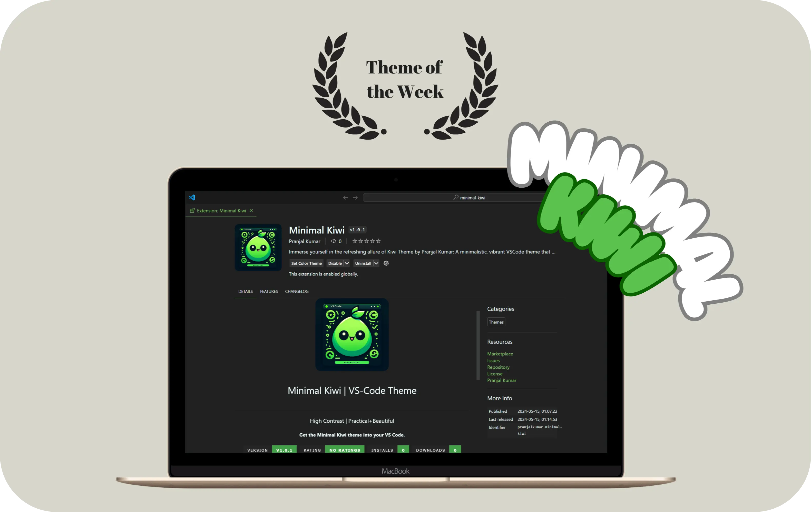
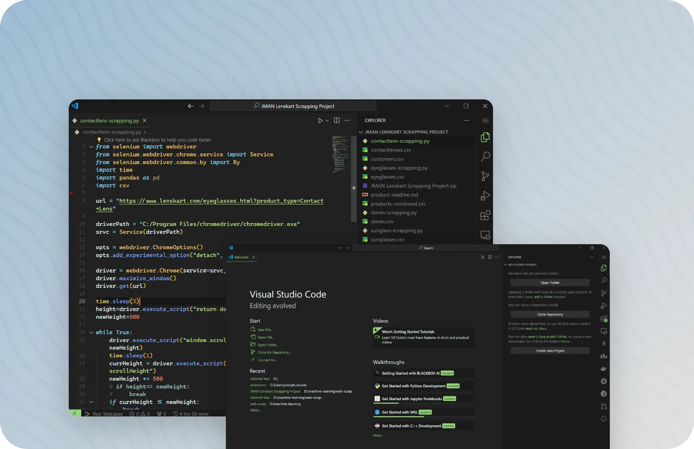
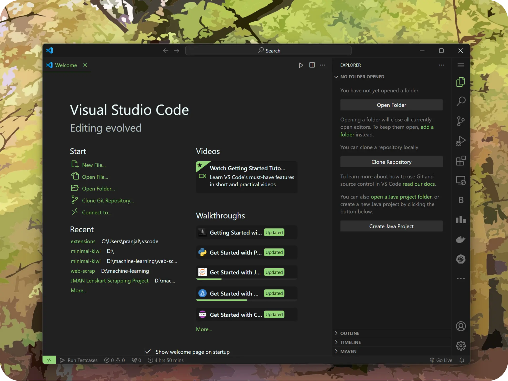
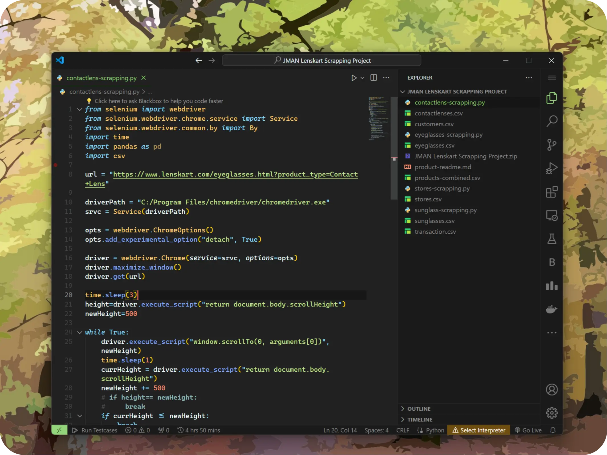
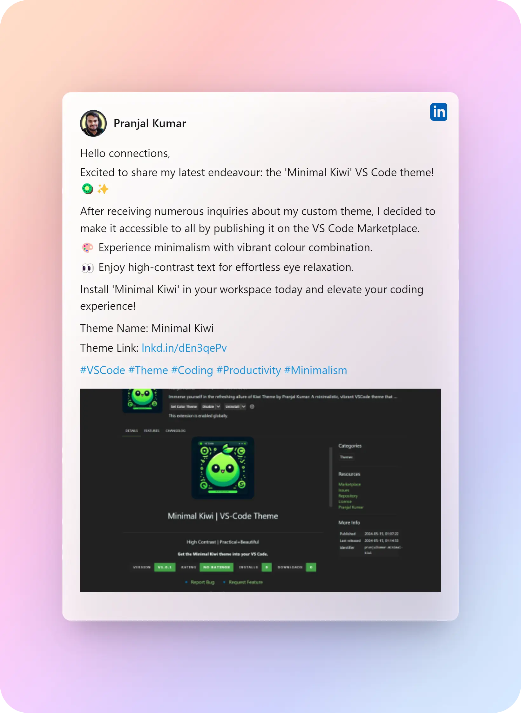

<h1 align="center">
  <br>
    
  <br><br>
  <a href="https://marketplace.visualstudio.com/items?itemName=PranjalKumar.minimal-kiwi">
  Minimal Kiwi | VS-Code Theme
  </a>
  <br>
</h1>

<h3 align="center">High Contrast | Practical+Elegant</h3>
<h4 align="center">Get the Minimal Kiwi theme into your VS Code.</h4>

<p align="center">
    <a href="https://marketplace.visualstudio.com/items?itemName=PranjalKumar.minimal-kiwi"></a>&nbsp;
    <a href="https://marketplace.visualstudio.com/items?itemName=PranjalKumar.minimal-kiwi"></a>&nbsp;
    <a href="https://marketplace.visualstudio.com/items?itemName=PranjalKumar.minimal-kiwi"></a>
</p>

<h3 align="center">
    🔹
    <a href="https://github.com/pranjal-barnwal/minimal-kiwi/issues">Report Bug</a> &nbsp; &nbsp;
    🔹
    <a href="https://github.com/pranjal-barnwal/minimal-kiwi/discussions">Discuss</a>
    🔹
    <a href="https://github.com/pranjal-barnwal/minimal-kiwi/issues">Request Feature</a>
    🔹
</h3>
<h3 align="center">
    🔹
    <a href="https://github.com/pranjal-barnwal/minimal-kiwi/blob/main/CONTRIBUTING.md">Open Source</a>
    🔹
    <br/>
    <br/>
    <a href="https://www.producthunt.com/posts/minimal-kiwi?utm_source=badge-featured&utm_medium=badge&utm_souce=badge-minimal&#0045;kiwi" target="_blank"></a>
</h3>

<br>


Immerse yourself in the refreshing allure of Kiwi Theme by Pranjal Kumar: A minimalistic, vibrant VSCode theme that harmonizes productivity with the soothing hues of green.
<br/><br/>



<br/><br/>


# Table of Content
- [Screenshots](#screenshots)
- [How to Install](#how-to-install)
- [How to Activate](#how-to-activate)
- [How to Contribute](#how-to-contribute)
- [Contributors](#contributors)
- [Show your Support](#show-your-support)
<br/><br/>


# Screenshots


<br/><br/>


# How to install
**There are 3 ways to install this extension:**
1. Install from Marketplace Website
   - You can install this theme through the [Visual Studio Code Marketplace](https://marketplace.visualstudio.com/items?itemName=PranjalKumar.minimal-kiwi)
   - Click `Install` button and allow it to launch VS Code

2. Install in VS Code
   - Launch *Quick Open*:
     -  <a href="https://code.visualstudio.com/shortcuts/keyboard-shortcuts-linux.pdf">Linux</a> `Ctrl + P`
     -  <a href="https://code.visualstudio.com/shortcuts/keyboard-shortcuts-macos.pdf">macOS</a> `⌘ + P`
     -  <a href="https://code.visualstudio.com/shortcuts/keyboard-shortcuts-windows.pdf">Windows</a> `Ctrl + P`
   - Paste the following command and press `Enter`:
    ```
    ext install minimal kiwi
    ```
   - And pick the one published by **Pranjal Kumar** as author
3. Install from a VSIX file
   - Download `minimal-kiwi-x.x.x.vsix` file from [Github Repository Releases](https://github.com/pranjal-barnwal/minimal-kiwi/releases)
   - Launch *Command Palette*:
     -  <a href="https://code.visualstudio.com/shortcuts/keyboard-shortcuts-linux.pdf">Linux</a> `Ctrl + Shift + P`
     -  <a href="https://code.visualstudio.com/shortcuts/keyboard-shortcuts-macos.pdf">macOS</a> `⌘ + Shift + P`
     -  <a href="https://code.visualstudio.com/shortcuts/keyboard-shortcuts-windows.pdf">Windows</a> `Ctrl + Shift + P`
   - Paste the following command and press `Enter`:
    ```
    Extensions: Install from VSIX
    ```
   - Select to the .vsix file you downloaded just now
<br/><br/>

# How to Activate
1. Launch *Command Palette*:
   -  <a href="https://code.visualstudio.com/shortcuts/keyboard-shortcuts-linux.pdf">Linux</a> `Ctrl + Shift + P`
   -  <a href="https://code.visualstudio.com/shortcuts/keyboard-shortcuts-macos.pdf">macOS</a> `⌘ + Shift + P`
   -  <a href="https://code.visualstudio.com/shortcuts/keyboard-shortcuts-windows.pdf">Windows</a> `Ctrl + Shift + P`
2. Select `Preferences: Color Theme`
3. Select `Minimal Kiwi` from the list
4. And then, **Enjoy!**
<br/><br/>


# How to Contribute
> Open for contributions.
Learn more about [creating extensions](./vsc-extension-quickstart.md).

[](https://github.com/pranjal-barnwal/minimal-kiwi)
[](https://github.com/pranjal-barnwal/minimal-kiwi)

1. Fork & Clone the [repo](https://github.com/pranjal-barnwal/minimal-kiwi)
    ```pwsh
    git clone git@github.com:{YOUR_GITHUB_USERNAME}/minimal-kiwi.git
    ```

2. Move to the `minimal-kiwi` directory
    ```pwsh
    cd minimal-kiwi
    ```

3. Make the required changes in color-schema & other properties in: `./themes/Minimal Kiwi-color-theme.json`. Also update the ***version*** in `./package.json`.

4. For packaging we're using `vsce` package and `Yeoman` & `generator-code` for management. So install the required dependencies.
    ```pwsh
    npm install -g vsce yo generator-code
    ```

5. Then package the changes, to be pushed into Marketplace
    ```pwsh
    vsce package
    ```
    > This should generate a `minimal-kiwi-{VERSION}.vslx` file. If not then resolve the errors being caused.

6. Commit & push the updated changes. Then make a PR to this [repo](https://github.com/pranjal-barnwal/minimal-kiwi).
<br/><br/>

<a href='https://www.linkedin.com/feed/update/urn:li:activity:7196242280431652864'>

</a>


# Contributors
<a href="https://github.com/pranjal-barnwal/minimal-kiwi/graphs/contributors">
  
</a>
<br/><br/>

# Show your support
Hit the ⭐ if you liked this project!


<iframe style="border: none;" src="https://cards.producthunt.com/cards/posts/458005?v=1" width="500" height="405" frameborder="0" scrolling="no" allowfullscreen></iframe>